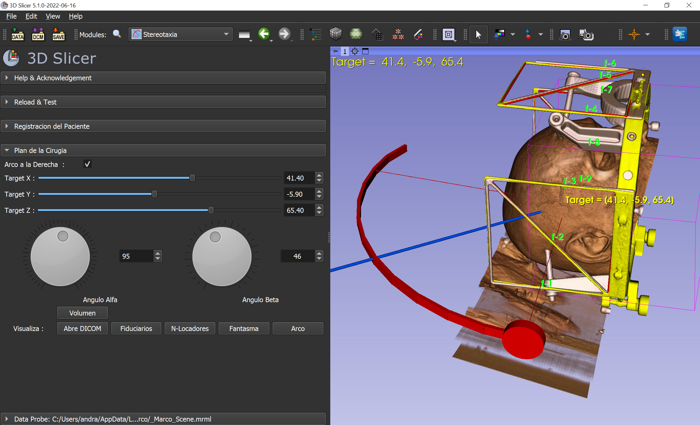
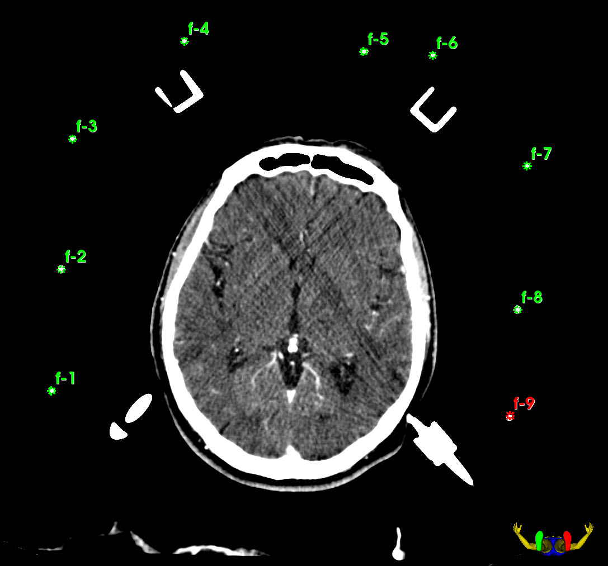

# Stereotaxia

3D Slicer extension for computing stereotactic frame coordinates for neurosurgery planning using a Micromar Stereotactic device. See a short demo video [here](3dSLICER_STEREOTAXIA.mp4).

Modules:

- Stereotaxia: a module with graphics (stereotatic frame, volume, entry_point, target_point) that do registration and 3D coordinates conversion for neurosurgery planning. you can modify manually the frame parameters.
- StereotaxiaLite: converts 2D fiducial entry and target coordinates into 3D reference on a CT volume.

## Installation

- [Download and install 3D Slicer](https://download.slicer.org/)
- [Install `Stereotaxia` extension](https://slicer.readthedocs.io/en/latest/user_guide/extensions_manager.html#install-extensions)

## Tutorial

- Go to StereotaxiaLite module.
- Load CT with head frame. For testing, `CTHeadFrame` data set in Sample Data module can be used.
- Click `Registracion` button.
- Click on the 9 intersection points of the frame in the order shown in the image below:

- Click `Target` button and then click in the image to specify the target point.
- Click `Entry` button and then click in the image to specify the entry point on the skin.
- Computed angles are displayed in `Resultados` section

## References

Jorge Beninca, MD; Elena Zemma, MD; Dante Lovey, MD; Lucas Vera, MD; Miguel Ibáñez, MD, "Programa para la planifcación de cirugías estereotácticas" (Software for stereotactic surgery planning), NeuroTarget - Vanguardia en Neurociencia, 
Vol 11, No 4., 2017 - http://neurotarget.com/numero.php?idn=30
